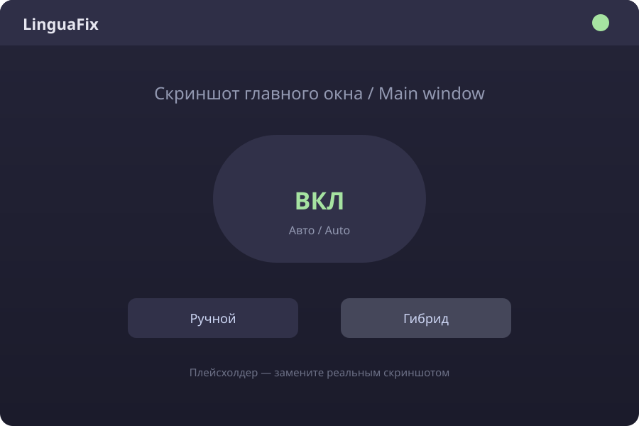
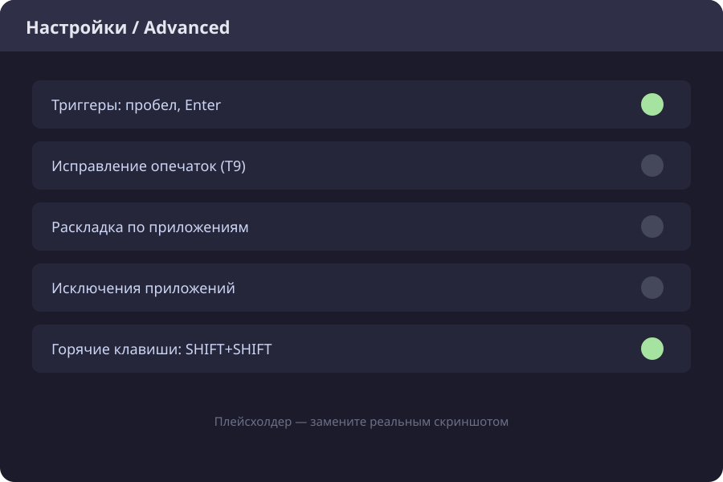
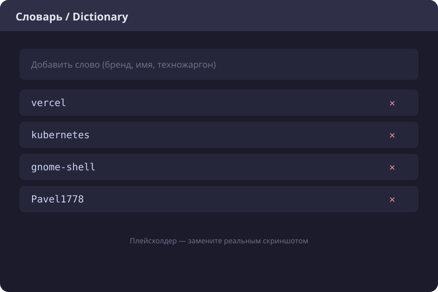

# LinguaFix

> **Твой язык. Автоматически.** — Your language. Automatically.
> Автоматическое переключение раскладки клавиатуры для Debian GNOME (X11 и Wayland).

LinguaFix — автоматический переключатель раскладки клавиатуры для Linux. Исправляет текст, набранный не в той раскладке (`ghbdtn` → `привет`), автоматически и мгновенно. Работает в Wayland и X11, GNOME 45+, KDE, Sway, через `evdev` + `uinput`. Аналог Caramba Switcher и Punto Switcher. Бесплатно, MIT, без телеметрии.

[](https://github.com/Pavel1778/LinguaFix/actions/workflows/ci.yml)
[](LICENSE)
[](https://www.python.org/downloads/)
[](#-требования--requirements)

---

## 🇷🇺 О проекте

Вы печатаете `ghbdtn`, а на экране появляется `ghbdtn` вместо `привет`?
LinguaFix замечает это, исправляет текст и переключает раскладку —
автоматически, без вашего участия.

Демон читает нажатия клавиш напрямую через `evdev`, накапливает набранный
текст и после короткой паузы проверяет, соответствует ли он текущей
раскладке. Если слово «превращается» в осмысленное при смене раскладки —
LinguaFix переписывает его и переключает язык. Проект вдохновлён
**Caramba Switcher** для Windows (упоминание бренда только как источника идеи).

## 🇬🇧 About

LinguaFix is a background daemon for Debian GNOME (X11 and Wayland) that
detects text typed in the wrong keyboard layout and fixes it automatically.
It reads raw key events via `evdev`, tracks the word you are typing, and — the
moment you press Space or Enter — replaces mistyped text and switches the
layout, with no visible pause. Inspired by
Caramba Switcher for Windows.

## 🖼️ Демо / Demo

```
  Печатаете:   ghbdtn
  Получаете:   привет   ← LinguaFix исправил и переключил раскладку
```


## 📸 Скриншоты / Screenshots

| Главное окно / Main window | Настройки / Advanced | Словарь / Dictionary |
|---|---|---|
|  |  |  |

> Скриншоты — плейсхолдеры. Замените файлы в `docs/screenshots/` реальными
> снимками (формат `.png`, тот же размер кадра), не меняя имена — README
> подхватит их автоматически.

## ✨ Возможности / Features

- 🔄 Автоматическое определение неверной раскладки
- ⌨️ Исправление уже набранного текста (`ghbdtn` → `привет`)
- 🌐 Работает в X11 и Wayland (GNOME)
- 💻 Совместим с терминалами, браузерами и IDE
- 🚀 Автозапуск при входе в систему
- 🔔 Уведомления (`notify-send`) и иконка в трее (AppIndicator)
- 🛡️ Стоп-слова для защиты паролей и логинов
- ⚙️ Настраиваемые таймауты, языки и backend'ы
- 🧩 CLI: `start`, `stop`, `restart`, `kill`, `status`, `config`, `fix`, `dict`,
  `export`, `import`, `doctor`, `collect-logs`, `logs`
- 🩺 `linguafix doctor` — самодиагностика окружения с таблицей ✅/❌ и подсказками
- 📜 `linguafix logs` — показать журнал демона (`-n`, `-f`, `--level`)
- 📦 `linguafix collect-logs` — один tarball со всей диагностикой для баг-репорта
- 🔁 Горячая перезагрузка конфига по `SIGHUP`
- 🧪 Флаг `--dry-run` — анализ без изменения текста (отладка и тесты)
- 🔒 Приватность: в лог пишутся только метаданные, набранный текст не сохраняется

## 🎯 Сравнение с аналогами / Comparison

| Возможность | XNeur | gswitch | lay | LinguaFix |
|---|---|---|---|---|
| Автоматическое исправление | ⚠️ | ❌ | ⚠️ | ✅ |
| Wayland | ❌ | ✅ | ❌ | ✅ |
| Работа в терминалах | ⚠️ | ✅ | ⚠️ | ✅ |
| Переключение раскладки | ⚠️ | ❌ | ❌ | ✅ |
| Защита паролей (стоп-слова) | ❌ | ❌ | ❌ | ✅ |
| Иконка в трее | ✅ | ❌ | ❌ | ✅ |

## 📋 Требования / Requirements

- Debian 12+ или Ubuntu 22.04+
- GNOME 45+ (тестировалось на 48; `g3kb-switch` зависит от версии
  GNOME Shell — на старых версиях переключение раскладки может не работать)
- X11 или Wayland
- Python 3.10+
- Пакеты: `python3-evdev`, `wtype` (Wayland) или `xdotool` (X11)
- Для переключения раскладки в Wayland: `g3kb-switch`
- Для GUI (вкладка настроек): `python3-gi`, `gir1.2-gtk-4.0`, `gir1.2-adw-1`
- Для трея (опционально): `python3-gi`, `gir1.2-appindicator3-0.1`

> GUI-стек (`python3-gi gir1.2-gtk-4.0 gir1.2-adw-1`) в `.deb` объявлен как
> `Recommends`, а не `Depends`: на сервере без графики он не нужен. `apt`
> ставит `Recommends` по умолчанию, поэтому обычная установка даёт рабочий
> GUI; если вы ставили с `--no-install-recommends`, доставьте их вручную.
> `linguafix doctor` покажет отдельную строку «Графический интерфейс» с
> точной командой.

## 🚀 Установка / Installation

Есть два пути. Обычному пользователю нужен первый.

### Для пользователей: пакет .deb (ничего настраивать не нужно)

```bash
sudo apt install ./linguafix_0.2.1_all.deb
```

Пакет **самодостаточен**: он ставит udev-правило с `TAG+="uaccess"`, включает
systemd user-сервис и загружает модуль `uinput` во время установки. Не нужно
`usermod`, не нужно добавлять себя в группу `input`, не нужно ничего включать
вручную — сервис стартует при следующем входе в сессию.

> ℹ️ Доступ к устройствам выдаётся активному пользователю сессии через ACL
> (`uaccess`), а не постоянным членством в группе. Это безопаснее и не требует
> перелогина после `usermod`.

Готовый `.deb` берётся со страницы
[Releases](https://github.com/Pavel1778/LinguaFix/releases) или собирается
локально: `make build-deb`.

### Для разработчиков: из исходников

```bash
git clone https://github.com/Pavel1778/LinguaFix.git
cd LinguaFix
bash install.sh          # добавьте --yes для неинтерактивного режима
```

`install.sh` ставит то же самое, но в venv внутри `~/.local/share/linguafix`.
Доступ к устройствам по-прежнему выдаётся через udev-правило с `uaccess`.

Подробности: [docs/INSTALL.md](docs/INSTALL.md).

## ⚡ Быстрый старт / Quick start

```bash
linguafix doctor                       # самодиагностика окружения (таблица ✅/❌)
linguafix status                       # проверить, что демон запущен
linguafix fix --text ghbdtn            # предпросмотр исправления
linguafix fix --text ghbdtn --apply    # применить исправление
linguafix fix --text ghbdtn --apply --dry-run   # показать, но не применять
linguafix start --foreground --dry-run # демон-наблюдатель: только логирует
linguafix dict add vercel              # научить слово, которое нельзя исправлять
linguafix config show                  # показать конфигурацию
linguafix config path                  # путь к config.toml
linguafix export ~/lf-backup.json      # бэкап настроек, словаря и сниппетов
linguafix import ~/lf-backup.json      # восстановить из бэкапа
linguafix restart                      # перезапустить демон
linguafix logs -n 50                   # последние 50 строк журнала
linguafix logs -f --level DEBUG        # следить за журналом, только DEBUG
linguafix collect-logs                 # собрать архив для баг-репорта
systemctl --user status linguafix.service
```

Флаг `--dry-run` удобен для отладки: демон полностью читает и анализирует
ввод, пишет в лог, что *собирался* исправить, но не переключает раскладку и
не трогает текст.

Ручное исправление последнего слова по умолчанию — **двойной Shift**
(дважды нажать Shift в течение 2000 мс). Двойной Shift работает на любой
клавиатуре, в отличие от прежнего `PAUSE` (клавиши Pause на многих ноутбуках
нет). Окно сделано широким намеренно: при быстром наборе два нажатия Shift
(например, при вводе заглавных) укладываются в 300 мс и вызывали ложные
срабатывания, а каждое ложное срабатывание удаляет и перепечатывает текст.
Осознанный двойной тап всё равно быстрее двух секунд. В GUI то же самое
можно задать кнопкой «Изменить»: дважды нажмите
Shift, Ctrl или Alt.

Двойной Shift исправляет и слова из 1–2 символов (`фт` → `an`), которые
обычный детектор пропускает из-за `min_word_length`. Такое короткое слово
переключается, только если результат однозначен: это известное слово целевого
языка, а исходное — не слово текущего. Слишком короткое и неоднозначное
(например одиночная буква) остаётся нетронутым — ошибочная догадка хуже, чем
её отсутствие. Чтобы принудительно задать конкретное слово, добавьте его в
словарь (`linguafix dict add`).

## ⚙️ Конфигурация / Configuration

Файл: `~/.config/linguafix/config.toml` (создаётся с настройками по умолчанию).

```toml
analysis_timeout = 0.8     # запасной таймер простоя, секунды (слова без разделителя)
analysis_timeout_adaptive = true  # подстраивать таймер под скорость печати
min_word_length = 3        # не анализировать короткие слова
max_buffer_size = 200      # верхняя граница буфера нажатий
layouts = ["us", "ru"]     # порядок раскладок
backend = "auto"           # auto | uinput | wtype | xdotool
switch_method = "auto"     # auto | g3kb-switch | setxkbmap
notify_on_fix = false      # уведомление при исправлении
tray_enabled = true        # иконка в трее
hotkey = "SHIFT+SHIFT"     # ручной триггер исправления (двойной Shift)
log_level = "INFO"         # DEBUG | INFO | WARNING | ERROR

# Хоткеи. Двойной тап модификатора задаётся как SHIFT+SHIFT / CTRL+CTRL / ALT+ALT.
hotkey_fix_last_word = "SHIFT+SHIFT"
# Undo: SHIFT+BACKSPACE, НЕ Ctrl+Z. Ctrl+Z конфликтует с собственным undo
# приложения (демон не перехватывает клавиатуру), поэтому взято Shift+Backspace.
hotkey_undo_last_fix = "SHIFT+BACKSPACE"
hotkey_reload_config = "CTRL+SHIFT+R"
hotkey_double_tap_ms = 2000  # окно двойного тапа, мс (100–3000)

# Триггеры по границе слова: слово исправляется мгновенно, без паузы.
on_space = true            # пробел — основной триггер
on_enter = true            # Enter — конец строки
on_tab = false             # Tab (включать осторожно)
on_punctuation = false     # знаки препинания (включать осторожно)
punctuation_chars = ".!?,;:"

# Пауза после удаления перед вводом нового текста (Chromium/Electron).
backspace_settle_ms = 80
# Пауза после триггера по границе (пробел/Enter), пока приложение
# обрабатывает саму клавишу-границу, до начала удаления.
trigger_settle_ms = 50

# Слова, которые никогда не исправляются (пароли, логины, токены).
stop_words = [
  "password", "passwd", "login", "token", "secret", "apikey", "sudo",
]

# T9: исправление опечаток внутри слова (выключено по умолчанию).
typo_correction = false    # true — включить
typo_max_distance = 1      # 1 или 2 опечатки в коротком слове
typo_max_distance_long = 2 # 1 или 2 опечатки в слове длиной от 6 символов
typo_min_word_length = 4   # не трогать короткие слова

# Раскладка по приложениям: при фокусе приложения включать его раскладку.
app_layout_switch = false
[app_layouts]
# kitty = "ru"
# code = "us"

# Приложения, которые LinguaFix не трогает автоматически (терминалы, IDE,
# игры, где набранное — это команда или идентификатор, а не слово). Список
# уже заполнен разумными значениями; свои приложения можно добавить.
exceptions_apps = [
  "gnome-terminal", "konsole", "kitty", "alacritty", "code", "vim", "nvim",
  "steam", "lutris", "wine", "factorio",
]
exceptions_force_in_manual = []   # приложения, где работает и ручной fix

# Тихие часы: в этом окне автоматическая коррекция молчит, ручной fix работает.
quiet_hours_enabled = false
quiet_hours_start = "22:00"       # ЧЧ:ММ, начало (включительно)
quiet_hours_end = "08:00"         # ЧЧ:ММ, конец (не включительно)

# История исправлений для вкладки «История» (только метаданные: длина слова,
# языки, время; набранный текст не хранится).
history_size = 20
```

Слова исправляются **сразу** при нажатии пробела или Enter — ждать паузы не
нужно. `analysis_timeout` — это лишь запасной таймер для слов, набранных без
разделителя (например, длинного URL). Слова, которые являются частью URL,
e-mail, пути или версии (`github.com`, `test@example.com`, `3.14`), не
исправляются.

Клавиши, нажатые в короткое окно между удалением и вставкой текста, не
теряются: демон ставит их в очередь и доигрывает после исправления.

### Бренд, имя или техножаргон не исправляется

Частотные словари не знают брендов (`vercel`, `муксуд`), имён и жаргона, так что
детектор молчит: он не уверен, что `муксуд` — это английское `vercel`. Научите
слово — и конвертация станет для детектора «известной хорошей»:

```bash
linguafix dict add vercel     # теперь муксуд → vercel срабатывает
linguafix dict list           # показать слова
linguafix dict remove vercel  # удалить слово
```

В GUI есть вкладка **«Словарь»**: добавление и удаление слов, поиск, импорт и
экспорт файла, кнопка «Применить к демону» (перечитывает словарь без
перезапуска). Файл — `~/.local/share/linguafix/dictionary.txt`, по одному слову
на строку. Научаемое слово никогда не переписывается, а его конвертация в
другую раскладку считается верной. Демон сам никогда не пишет набранный текст в
этот файл.

### Исправление опечаток (T9)

Отдельно от раскладки LinguaFix умеет исправлять **опечатку внутри слова**
(`langauge` → `language`, `teh` → `the`). Функция выключена по умолчанию:
неверное исправление хуже, чем его отсутствие. Включается в GUI (вкладка
«Дополнительно» → «Исправление опечаток (T9)») или в конфиге
`typo_correction = true`.

Правило одно, и оно намеренно строгое: слово заменяется, только если оно

* отсутствует в словаре языка,
* не короче `typo_min_word_length` символов,
* отличается от **ровно одного** слова словаря не более чем на
  `typo_max_distance` правок (расстояние Дамерау — перестановка соседних букв
  считается за одну правку).

Для длинных слов правило чуть шире: слово длиной от 6 символов может
отличаться на `typo_max_distance_long` правок (по умолчанию 2), но только
если лучший вариант заметно частотнее второго — иначе LinguaFix молчит.

Если ближайших вариантов два и более (или слово уже верное) — LinguaFix молчит.
Научаемые слова и токены с разделителем (URL, e-mail, путь, `id-с-дефисом`)
никогда не «исправляются». T9 работает только там, где раскладка признана
верной, поэтому не спорит с авто-переключением.

После правки конфига перезапустите сервис или отправьте `SIGHUP`:

```bash
systemctl --user restart linguafix.service
# или
kill -HUP "$(cat ~/.cache/linguafix/daemon.lock)"
```

### Раскладка по приложениям

Приложения, в которых вы почти всегда печатаете на одном языке, можно
закрепить за раскладкой. При переходе фокуса на такое приложение LinguaFix
включит его раскладку (не чаще, чем раз в ~0.35 с, и не повторно, пока фокус
остаётся в нём — чтобы не спорить с ручным переключением).

```toml
app_layout_switch = true
[app_layouts]
kitty = "ru"
code = "us"
```

В GUI — вкладка **«Дополнительно»** → **«Раскладка по приложениям»**, с кнопкой
«Определить» текущее приложение.

### Исключения: где LinguaFix не трогает текст

В терминале, редакторе или игре набранное — это команда, идентификатор или
сообщение в чат, а не слово, поэтому «исправлять» его не нужно. Список
`exceptions_apps` уже заполнен (терминалы, VS Code и подобные IDE, Steam и
Wine); свои приложения можно добавить в GUI (вкладка **«Дополнительно»** →
**«Исключения»**). Ручной fix (двойной Shift) работает и внутри исключений.
Если в каком-то приложении вы хотите и автоматику, и ручной fix, добавьте его в
`exceptions_force_in_manual`.

### Тихие часы

Чтобы LinguaFix не переключал раскладку в заданное время (например, ночью),
включите `quiet_hours_enabled` и задайте `quiet_hours_start`/`quiet_hours_end`
в формате `ЧЧ:ММ`. Окно может пересекать полночь (`22:00`–`08:00`). Ручной fix
продолжает работать.

### История исправлений

Вкладка **«История»** показывает последние исправления и позволяет отменить
самое свежее. Хранятся **только метаданные** — длина слова, языки и время;
сам набранный текст не сохраняется нигде. Глубина списка — `history_size`.

### Сниппеты (текстовые сокращения)

В `~/.config/linguafix/snippets.toml` можно задать сокращения; они
разворачиваются **до** анализа раскладки:

```toml
[snippets]
"адр" = "ул. Ленина, д. 1"
"дт" = "{date}"
```

Включается через `text_expander_enabled = true` (GUI: **«Дополнительно»** →
**«Сниппеты»**). Поддерживаются подстановки `{date}` и `{time}`.

### Исправление уже выделенного текста

Выделите текст и нажмите `CTRL+SHIFT+L` — LinguaFix скопирует его, сменит
раскладку и вставит обратно. Хоткей настраивается в GUI; функция включается
через `selection_fix_enabled`.

### Защита полей паролей

Если AT-SPI сообщает, что фокус в поле пароля, исправление пропускается, даже
если слова нет в `stop_words`. Отключается через `password_guard = false`.

### Проверка обновлений

Единственная функция, которая ходит в сеть, — и она **выключена по умолчанию**.
Если включить `update_check_enabled = true` (GUI: **«Дополнительно»** →
**«Проверять обновления»**), демон раз в сутки запрашивает у GitHub номер
последней версии и, если вышла новее, пишет строку в лог и показывает
уведомление. Отправляется только обычный `GET` публичного релиза — ни
набранный текст, ни конфигурация не передаются.

## 🩺 Troubleshooting

| Проблема | Решение |
|---|---|
| Не исправляет | Запустите `linguafix doctor` — он проверит права, устройства и backend'ы |
| `Permission denied: /dev/input/...` | Перезагрузите udev-правило: `sudo udevadm control --reload-rules && sudo udevadm trigger`; проверьте `getfacl /dev/input/event3` — подробнее [TROUBLESHOOTING: ACL после .deb](docs/TROUBLESHOOTING.md#после-установки-deb-doctor-жалуется-на-права-devinput-или-devuinput) |
| `doctor` из TTY или ssh | Это ожидаемо: тип сессии `unknown` — см. [TROUBLESHOOTING: doctor из TTY/ssh](docs/TROUBLESHOOTING.md#doctor-запущен-из-tty-или-ssh) |
| Переключает, но не заменяет текст | Смените `backend` на `uinput` |
| Исправляет то, что не нужно | Включены проверки `plausibility_check`, `structural_boundaries`, `identifier_guard`; добавьте строку в `custom_skip_regex` — подробнее [TROUBLESHOOTING: ложные срабатывания](docs/TROUBLESHOOTING.md#a-string-i-typed-is-corrected-wrongly-false-positive) |
| Нужно вернуть последнее исправление | Хоткей undo (`SHIFT+BACKSPACE`) или кнопка **«Отменить последнее исправление»** в GUI |
| Хочу посмотреть журнал | `linguafix logs -f --level DEBUG` — набранный текст в журнал не попадает |
| Кнопка «включить» показывает битый значок | Обновите тему иконок или переустановите пакет: LinguaFix рисует символ питания сам, если темы нет |
| Не работает в терминале | Попробуйте `backend = "uinput"` |
| `linguafix gui` пишет «нужны GTK4 и libadwaita» | `sudo apt install python3-gi gir1.2-gtk-4.0 gir1.2-adw-1` (в `.deb` это `Recommends`; `doctor` покажет точную команду) |
| Нет иконки в трее | Установите `python3-gi gir1.2-appindicator3-0.1` |
| Сообщаете о баге | Приложите `linguafix collect-logs` — в архиве нет набранного текста |
| Конфликт с IBus/Fcitx | Отключите их, если не используете |
| Не переключает раскладку в Wayland | Установите `g3kb-switch` |

Полностью: [docs/TROUBLESHOOTING.md](docs/TROUBLESHOOTING.md).

## ❓ FAQ

**Работает ли LinguaFix в полях пароля?**
Нет — Wayland не позволяет определить, что фокус в поле пароля. Используйте
стоп-слова (`stop_words`), чтобы защитить конкретные строки.

**Почему не сработало в игре?**
Некоторые игры и Java/Swing-приложения перехватывают ввод и игнорируют
синтетические нажатия. Это известное ограничение Wayland.

**Как добавить язык?**
Добавьте раскладку в `src/linguafix/data/layouts.json` и файл
`src/linguafix/data/ngrams_<lang>.json` со словами и биграммами. См.
[docs/CONTRIBUTING.md](docs/CONTRIBUTING.md).

**Почему короткие слова не исправляются?**
У слов из 1–2 символов слишком мало статистического сигнала. Порог задаётся
параметром `min_word_length`.

**Как временно остановить LinguaFix?**
`systemctl --user stop linguafix.service` или `linguafix stop`.

**Нужны ли root-права?**
Только при установке (udev-правило и systemd-сервис). Сам демон работает от
пользователя.

**Как удалить LinguaFix?**
Для `.deb`: `sudo apt remove --purge linguafix`. Из исходников:
`bash uninstall.sh` (добавьте `--purge`, чтобы удалить конфиг и логи).

## 🧑💻 Разработка / Development

```bash
bash scripts/dev_setup.sh     # venv + dev-зависимости
make check                    # ruff + black + mypy --strict + pytest --cov
make test                     # только тесты с покрытием (>80%)
make build-deb                # собрать .deb в dist/
```

Архитектура и принятые решения: [docs/ARCHITECTURE.md](docs/ARCHITECTURE.md).
Ручной план тестирования на реальной системе: [docs/TESTING.md](docs/TESTING.md).

## ⚠️ Известные ограничения / Known limitations

- Демон не может определить поле пароля (ограничение Wayland) — митигация:
  стоп-слова.
- Точность на словах из 1–2 символов низкая — митигация: `min_word_length`.
- В некоторых играх и Java-приложениях замена текста может не работать.
- Доступ через `uaccess` применяется при входе в сессию: если пакет установлен
  в уже активной сессии, права появятся после следующего входа/перезагрузки.
- Переключение раскладки в GNOME Wayland требует `g3kb-switch`.
- Замена текста атомарна только на бэкенде `uinput`. На фолбэках `wtype` и
  `xdotool` удаление и ввод идут отдельными вызовами, поэтому при аварийном
  завершении посреди замены текст может остаться обрезанным. Используйте
  `uinput` (значение по умолчанию в Debian-пакете), где это возможно.
- Демон слушает все доступные клавиатуры; устройство с именем, содержащим
  `linguafix` или `uinput`, намеренно пропускается (защита от петли).
- T9 исправляет только слова из встроенного частотного словаря. Бренды,
  названия компаний и техножаргон (`vercel`, `kubernetes`, имена) в него не
  входят — добавьте их через `linguafix dict add <слово>`, иначе детектор
  промолчит.
- Языки `uk`, `de`, `fr` включаются вручную (`languages`) и проверены меньше,
  чем `en`/`ru`; по умолчанию активны только `en` и `ru`.
- Адаптивный таймер простоя — эвристика по скорости печати; при редком,
  неровном темпе он может сработать чуть раньше или позже. Отключается через
  `analysis_timeout_adaptive = false`.

## 🤝 Contributing

См. [docs/CONTRIBUTING.md](docs/CONTRIBUTING.md). Коммиты атомарные:
`feat: …`, `fix: …`, `docs: …`.

## 📄 Лицензия / License

MIT — см. [LICENSE](LICENSE).

История изменений — в [CHANGELOG.md](CHANGELOG.md). Баги и предложения —
в [Issues](https://github.com/Pavel1778/LinguaFix/issues).

## 🙏 Благодарности / Acknowledgements

- [gswitch](https://github.com/skroll/gswitch) — исполнитель исправлений.
- [g3kb-switch](https://github.com/dvorka/g3kb-switch) — переключение раскладки
  в GNOME Wayland.
- [python-evdev](https://python-evdev.readthedocs.io/) — чтение клавиатуры
  (`evdev`) и ввод текста (`evdev.UInput`).
- Идея вдохновлена Caramba Switcher для Windows.

## 🌐 Сайт

- **Основной сайт (RU):** https://linguafix.layero.app
- **Зеркало (EN):** https://linguafix.vercel.app

Оба сайта индексируются в поисковиках с per-host canonical и hreflang
(`ru` / `en` / `x-default`), поэтому они не конкурируют как дубликаты.
